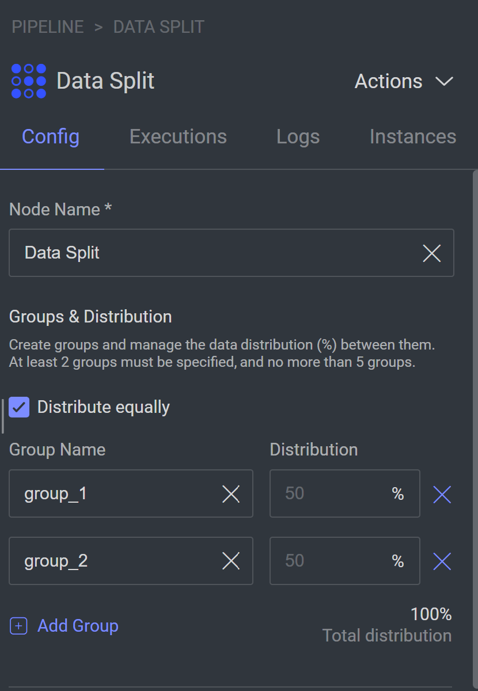

# Data Split Node

The **Data Split** node is a data processing tool that empowers you to split your data into multiple groups at runtime.
Use this node to segment your data into different subsets, simplifying the process.


## Quick Start:

1. Go to `Pipelines` and `Create new pipeline`.
2. Build a custom work flow that requires splitting the data into multiple groups on runtime.
3. Define the subsets and the distribution in the data split node configuration panel.
4. Start pipeline

## Node inputs and Outputs:

The Data Split node has one input and multiple outputs, each output represents a group.

## How it works:

When an item passes through the node, the node will randomly assign it to one of the groups according to the
distribution defined in the node configuration panel.

For each item that is assigned to a group:

- The item will pass through the corresponding group output, continuing the cycle in the flow designed for the randomly
  chosen group.
- [Optional] A tag will be added to the item's metadata under `metadata.system.tags.<group assigned>: True`.

#### Item metadata in group_1 Example

```json
{
  "system": {
    "tags": {
      "group_1": true
    }
  }
} 
```

## Node Configuration:



**Configuration**

- **Node Name:** Display name on the canvas.
- **Groups and Distribution:** Set groups (minimum 2, maximum 5) and the required distribution.
- **Distribute Equally:** Mark this option to force equal distribution between the groups.
- **Item Tags**: By default, this option allows you to add metadata tag to items once they are assigned to a group. The
  tag will be the group name and will be added to the item's metadata [tag](#item-metadata-in-group_1-example).

## Contributions, Bugs and Issues - How to Contribute

We welcome anyone to help us improve this app.  
[Here's](CONTRIBUTING.md) a detailed instructions to help you open a bug or ask for a feature request.